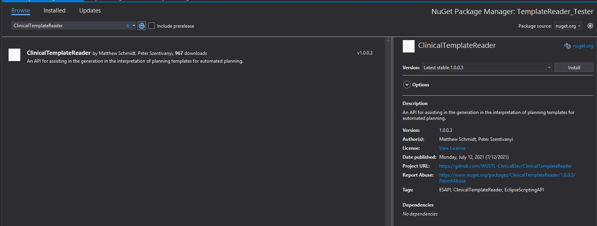
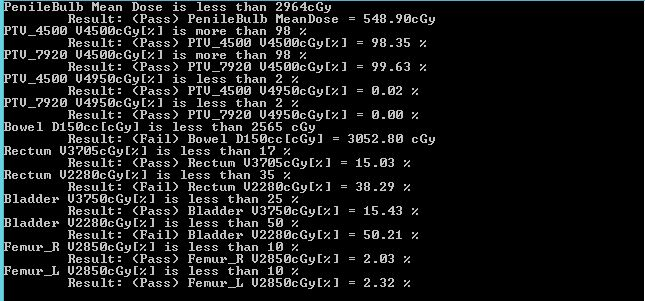

# Use and Description
The following is an example of using the ClinicalTemplateReder for automated planning. 
Start by generated a Stand-alone executable with the Eclipse Script Wizard


## Save your solution!
Change your target framework to **.NET 4.5.2.**
Go to the Nuget Package Manager and find the **ClinicalTemplateReader** package. You may find this by searching ESAPI. 
* For Version 15.6, make sure to get version **1.0.0.5**
* For Version 16.0, make sure to get version **2.0.0.1**



Add the following using to your code to resolve the ClinicalTemplateReader related references:
```csharp
using ClinicalTemplateReader;
```

## Review Template Statistics
In the Execute Method post the following code 

```csharp
static void Execute(Application app)
{
    //Checking clinical templates
    Console.WriteLine("Reading Clinical Templates");
    string server = "Varian Image Server"; // <== update to your image server address e.g. "localhost", "10.11.12.13"
    var clinicalProtols = new ClinicalTemplate(server);

    var planStats_cp = clinicalProtols.GetPlanTemplateApprovals(true);
    Console.WriteLine("Plan Template statistics with clinical protocols");            
    foreach (var planstat in planStats_cp)
    {
        Console.WriteLine($"\t{planstat.ApprovalStatus} - {planstat.Count}");
    }

    var objStats_cp = clinicalProtols.GetObjectiveTemplateApprovals(true);
    Console.WriteLine("Objective Template Statistics with clinical protocols");
    foreach (var objstat in objStats_cp)
    {
        Console.WriteLine($"\t{objstat.ApprovalStatus} - {objstat.Count}");
    }

    Console.ReadLine();
}
```

Running this should give the following response in the console.


## Selecting a plan template
The following code will allow you to select a plan template.

```csharp
static void Execute(Application app)
{
    // Checking clinical templates
    string server = "Varian Image Server"; // <== update to your image server address e.g. "localhost", "10.11.12.13"
    var clinicalProtols = new ClinicalTemplate(server);

    var approvedTemplates = clinicalProtols.PlanTemplates.Where(x => x.Preview.ApprovalStatus.Contains("Approved")).ToList();
    for (int i = 0; i < approvedTemplates.Count(); i++)
    {
        Console.WriteLine($"[{i}]. {approvedTemplates.ElementAt(i).Preview.ID} - {approvedTemplates.ElementAt(i).Preview.LastModified}");
    }

    Console.WriteLine($"\n\nPlease pick your plan template from the list (0 - {approvedTemplates.Count() - 1}):");
    var plantemplatenumber = Convert.ToInt32(Console.ReadLine());
    var plantemplate = approvedTemplates.ElementAt(plantemplatenumber);
    Console.WriteLine("\nObjective Template List (Approved):");

    //Get template description
    Console.WriteLine($"\n\nDescription of plan template");
    Console.WriteLine($"Number of Fields: {plantemplate.Fields.Count()}");
    Console.WriteLine($"Plan Rx: {plantemplate.DosePerFraction} x {plantemplate.FractionCount}");

    Console.ReadLine();
}
```

The result:


## Generating a plan from a template.
Finally, the following code will utilize the ClinicalTemplateReader API to generate an automated plan.

```csharp
static void Execute(Application app)
{
    // Generate plan from template
    string server = "Varian Image Server"; // <== update to your image server address e.g. "localhost", "10.11.12.13"
    var clinicalProtols = new ClinicalTemplate(server);

    var approvedTemplates = clinicalProtols.PlanTemplates.Where(x => x.Preview.ApprovalStatus.Contains("Approved")).ToList();
    var plantemplate = approvedTemplates.ElementAt(1); // Select an approved plan template

    var _patient = app.OpenPatientById("PatientIDHere"); // Give a valid PatientID1 
    var _structureSet = _patient.StructureSets.FirstOrDefault(x => x.Id == "ROI");
    Console.WriteLine("\n\nGenerating new automation plan");
    _patient.BeginModifications();
    //Generate plan
    var _newplan = clinicalProtols.GeneratePlanFromTemplate(null, _structureSet, plantemplate, null);
    //Set Prescription.
    clinicalProtols.SetRx(plantemplate, _newplan, "cGy");
    string plan_update = $"Plan created with {_newplan.Beams.Count()} beams";
    Console.Write($"Generated Plan {_newplan.Id} in {_newplan.Course.Id}\n{plan_update}\nPlan Rx: {_newplan.TotalDose} in {_newplan.NumberOfFractions}fx");
    app.SaveModifications();
    app.ClosePatient();

    Console.ReadLine();
}
```
To execute this part you must add the following attribute to your code:
```csharp
[assembly: ESAPIScript(IsWriteable = true)]
```

The response from the console should be as follows. 


After refreshing the patient in Eclipse, you should see a new course, plan, and fields generated on the patient.


## Read Plan Quality Metrics from Clinical Protocols
A new feature available in Version 1.0.0.3 is the ability to leverage the plan quality metrics in a clinical protocol to evaluate the plan. Below is the code to select a clinical protocol, and based on that clinical protocol determine the pass/fail of each clinical plan.
This does not require that you first build the plan with the ClinicalTemplateReader, but rather can be used as a stand-alone feature for getting plan goals.
**NOTE: This works for both plans and plan sums, so now you can build clinical protocols with goals for an overall plansum and get the objective results!**
```csharp
    var reader = new ClinicalTemplate("Varian Image Server");
    Console.WriteLine("Please select a clinical protocol:");
    int cp_num = 0;
    Console.WriteLine("Approval Statuses");
    Console.WriteLine($"{String.Join("\n",reader.ClinicalProtocols.Select(x=>x.Preview.ApprovalStatus).Distinct())}");
    var clinicalProtocols = reader.ClinicalProtocols.Where(x => x.Preview.ApprovalStatus == "Approved");
    foreach (var cps in clinicalProtocols)
    {
        Console.WriteLine($"[{cp_num}]. {cps.Preview.ID} - {cps.Preview.TreatmentSite}: {cps.Preview.LastModified}");
        cp_num++;
    }
    int cp_selection = Convert.ToInt32(Console.ReadLine());
    var clinicalprotocol = clinicalProtocols.ElementAt(cp_selection);
    //open patient, course and plan.
    var patient = app.OpenPatientById("PatientId");//patient id here
    var course = patient.Courses.FirstOrDefault(x => x.Id == "CourseId");//course id here
    var plan = course.PlanSetups.FirstOrDefault(x => x.Id == "PlanId");//plan id here
    //This is the method that compares the planning item to the clinical protocol.
    var metrics = reader.CompareProtocolDoseMetrics(plan, clinicalprotocol);
    foreach(var doseMetric in metrics)
    {
        Console.WriteLine($"{doseMetric.MetricText}\n\tResult: ({doseMetric.Pass}) {doseMetric.ResultText}");
    }
```
The final result should look something like this.



## Optimze plan with DVHEstimation (RapidPlan) -- V16 Only
In V16, the Rapidplan details, such as the structures included in a Rapidplan model, can be queried with ESAPI. This feature can now be leveraged by the ClinicalTemplateReader.
First set up the code to allow the user to select the Rapidplan model they want to select for a given plan. Here _newplan_ is used as an example as seen above
```csharp
    //optimize plan using Rapidplan.
    var rp_models = app.Calculation.GetDvhEstimationModelSummaries();
    var rp_count = 0;
    foreach(var rp in rp_models)
    {                    
        Console.WriteLine($"[{rp_count}]. {rp.Name} - {rp.TreatmentSite}");
        rp_count++;
    }
    Console.WriteLine("Please pick your RP Model:");
    int rp_num = Convert.ToInt32(Console.ReadLine());
    var rp_model = rp_models.ElementAt(rp_num);
    clinicalProtols.OptimizeFromRapidPlanModel(app.Calculation.GetDvhEstimationModelStructures(rp_model.ModelUID), _newplan, rp_model, null, null, false);
    if (_newplan.Beams.First().Technique.Id.Contains("ARC"))
    {
        _newplan.CalculateDose();
    }
    else 
    {
        _newplan.CalculateLeafMotionsAndDose();
    } 
    app.SaveModifications();

```
Once the code has run, you should have optimization results driven by the DVH Estimation algorithm. 


Some notes regarding this method
- The *targetmatches* and *structurematches* can be determined by the client code beforehand and passed into the method.
- The method can also determine these matches for you by matching first based on structure name and then on structure code. **So make sure your Rapidplan model matches your structure template structure Ids**
- Target matches will always use the plan total dose as the dose input.
